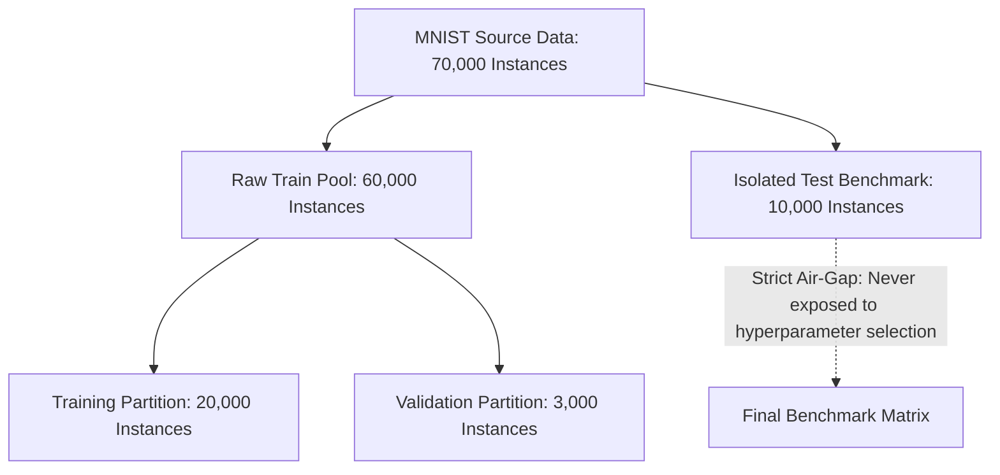

# DIGITVISION AI — MNIST Dataset Foundation Specification

**Document Version:** 1.0.0  
**Phase:** 01 — Data Intelligence & Foundation  
**Classification:** Core System Specification  
**Status:** Live & Executable  

---

## 1. Executive Summary & Purpose

The **Modified National Institute of Standards and Technology (MNIST)** dataset serves as the foundational empirical benchmark for handwritten digit recognition within the DIGITVISION AI platform. Originally curated by Yann LeCun, Corinna Cortes, and Christopher J.C. Burges in 1998, MNIST provides a standardized corpus of isolated numeric glyphs extracted from Special Database 3 (high school students) and Special Database 19 (U.S. Census Bureau employees).

Within DIGITVISION AI, MNIST is utilized not merely as a toy classification task, but as a rigorous testbed for:
1. **Geometric Invariance Testing:** Quantifying classifier sensitivity to morphological deformations, stroke width variations, and spatial shifts.
2. **Explainable AI (XAI) Attribution:** Validating visual explanation methods (Grad-CAM, Saliency) against ground-truth anatomical stroke strokes.
3. **Out-of-Distribution (OOD) & Uncertainty Calibration:** Evaluating whether models appropriately communicate epistemic uncertainty when presented with malformed digits, fragmented strokes, or non-digit strokes.

---

## 2. Dataset Provenance & Architectural Source

| Attribute | Specification |
| :--- | :--- |
| **Originating Authors** | Yann LeCun (Courant Institute, NYU), Corinna Cortes (Google), Christopher Burges (Microsoft) |
| **Primary Repository** | `yann.lecun.com/exdb/mnist/` (NIST Special Database 19 / 3) |
| **Ingestion Pipeline** | `src.data.dataset.MNISTPipeline` |
| **Original Format** | Big-endian binary IDX file format (magic number 2051 for images, 2049 for labels) |
| **Total Available Instances** | 70,000 scanned grayscale digit images |

---

## 3. Partitioning & Data Isolation Invariant

To guarantee absolute absence of data leakage and enable rigorous scientific benchmarking, DIGITVISION AI enforces strict partition isolation in `src/config.py`:

```
TOTAL CORPUS (70,000 Samples)
├── RAW TRAINING REPOSITORY (60,000 Samples)
│   ├── Active Training Split:      20,000 samples (Configurable up to 57,000)
│   └── Validation / Tuning Split:   3,000 samples (Configurable up to 10,000)
└── ISOLATED BENCHMARK TEST SET:    10,000 samples (STRICTLY ISOLATED)
```



### Partition Hygiene Rules
1. **Zero Test Contamination:** The 10,000 test images are never exposed to training, hyperparameter optimization, or feature selection routines.
2. **Deterministic Seeding:** All train/validation splits use centralized seed `RANDOM_SEED = 42`.
3. **Memory Isolation:** Asserted by automated pytest tests verifying disjoint index sets and non-shared memory buffers.

---

## 4. Formal Mathematical Formulation

### 4.1 Sample & Label Spaces

Formally, each digit image in the primary convolutional pipeline is represented as a real-valued rank-3 spatial tensor:

$$X \in [0.0, 1.0]^{28 \times 28 \times 1} \subset \mathbb{R}^{28 \times 28 \times 1}$$

The ground-truth supervisory target is a discrete categorical scalar:

$$y \in \mathcal{Y} = \{0, 1, 2, 3, 4, 5, 6, 7, 8, 9\}$$

Where the class cardinality is:

$$|\mathcal{Y}| = K = 10$$

### 4.2 Tensor vs. Flattened Feature Representations

DIGITVISION AI explicitly differentiates between **spatial image tensors** (consumed by Convolutional Neural Networks) and **flattened feature vectors** (consumed by linear classifiers, SVMs, and tree ensembles). These two representations are never conflated:

```
┌──────────────────────────────────────────────┐
│  Spatial Tensor Representation:              │
│  X_tensor ∈ [0, 1]^(28 × 28 × 1)             │
│  Shape: (Batch, Height=28, Width=28, Ch=1)   │
│  Retains 2D spatial locality & neighborhood  │
│  Used by: DigitVisionConvNet, LeNet-5        │
└──────────────────────┬───────────────────────┘
                       │
                       │ Vectorization / Reshape
                       │ vec: ℝ^(28×28×1) → ℝ^784
                       ▼
┌──────────────────────────────────────────────┐
│  Flattened Feature Representation:           │
│  X_flat ∈ [0, 1]^784                         │
│  Shape: (Batch, Features=784)                │
│  Discards 2D topology; 1D coordinate vector  │
│  Used by: SVM (RBF), Random Forest, Softmax  │
└──────────────────────────────────────────────┘
```

The canonical vectorization operator $\text{vec}: \mathbb{R}^{28 \times 28 \times 1} \to \mathbb{R}^{784}$ maps index $(i, j)$ in row-major order:

$$k = i \cdot 28 + j \quad \text{where } i \in [0, 27], j \in [0, 27], k \in [0, 783]$$

---

## 5. Physical Image Dimensions & Pixel Telemetry

- **Spatial Resolution:** $28 \times 28$ pixels (784 total pixels per image).
- **Aspect Ratio:** $1:1$ square aspect ratio.
- **Channels:** $1$ (Monochrome / Grayscale).
- **Raw Storage Format:** 8-bit unsigned integers (`uint8`), where $p_{\text{raw}} \in [0, 255]$.
- **Normalized System Standard:** IEEE 754 32-bit floating point (`float32`), where $p_{\text{norm}} = \frac{p_{\text{raw}}}{255.0} \in [0.0, 1.0]$.
- **Background Convention:** $0.0$ represents pure black (inactive background).
- **Foreground Convention:** Values in $(0.0, 1.0]$ represent white/light antialiased stroke pixels.

### Global Sparsity Telemetry (from Empirical Pipeline Execution)
- **Mean Background Ratio (Pure 0.0):** $80.88\%$ of all pixels across the dataset are inactive background.
- **Mean Active Stroke Ratio ($>0.05$):** $19.12\%$ of all pixels contain stroke mass.
- **Global Pixel Mean ($\mu$):** $0.1307$
- **Global Pixel Standard Deviation ($\sigma$):** $0.3081$

---

## 6. Class Distribution & Balance

Empirical analysis across all three partitions demonstrates a nearly uniform, balanced distribution across all digits $0$ through $9$:

| Class $k$ | Digit Glyph | Train Split (20k) | Validation Split (3k) | Isolated Test (10k) | Relative Frequency (%) |
| :---: | :---: | :---: | :---: | :---: | :---: |
| 0 | '0' | 1,983 | 305 | 980 | 9.80% |
| 1 | '1' | 2,279 | 344 | 1,135 | 11.35% |
| 2 | '2' | 1,972 | 298 | 1,032 | 10.32% |
| 3 | '3' | 2,058 | 303 | 1,010 | 10.10% |
| 4 | '4' | 1,962 | 288 | 982 | 9.82% |
| 5 | '5' | 1,777 | 269 | 892 | 8.92% |
| 6 | '6' | 1,987 | 289 | 958 | 9.58% |
| 7 | '7' | 2,074 | 332 | 1,028 | 10.28% |
| 8 | '8' | 1,950 | 288 | 974 | 9.74% |
| 9 | '9' | 1,958 | 284 | 1,009 | 10.09% |
| **Total** | — | **20,000** | **3,000** | **10,000** | **100.00%** |

*Key finding:* Digit '1' has the highest frequency ($\approx 11.35\%$), while digit '5' has the lowest ($\approx 8.92\%$). Class imbalance is minimal (imbalance ratio $< 1.28$), confirming that standard Cross-Entropy loss without class re-weighting is statistically optimal.

---

## 7. Known Limitations of the MNIST Benchmark

While standard in computer vision pedagogy, MNIST exhibits specific domain limitations that DIGITVISION AI explicitly monitors and mitigates:

1. **Centering Artifacts:** In native MNIST, digits are pre-centered by center of mass. Unprocessed real-world handwriting with off-center strokes causes severe model degradation unless passed through the **Canonical Preprocessing Invariant**.
2. **Stroke Thickness Invariance:** Native digits are normalized to fit within a $20 \times 20$ bounding box; excessively thick or ultra-thin strokes can cause topological fragmentation.
3. **Absence of Background Clutter:** MNIST contains zero natural textures, illumination gradients, or shadow artifacts. Canvas inputs with textured backgrounds require the contrast normalization stage.
4. **Saturation of Modern Architectures:** State-of-the-art CNNs exceed $98.2\%$ test accuracy readily, rendering top-1 accuracy insufficient alone; calibration error (ECE), epistemic entropy, and adversarial robustness must be evaluated concurrently.

---

## 8. Associated Empirical Artifacts

All graphs generated from real data exploration are saved in `artifacts/data/`:
1. `artifacts/data/sample_image_grid.png`: $10 \times 10$ sample grid showing stroke variations.
2. `artifacts/data/class_distribution.png`: Exact partition counts and percentage balance.
3. `artifacts/data/pixel_intensity_distribution.png`: Bimodal histogram of background vs stroke pixels.
4. `artifacts/data/average_image_per_class.png`: Mean spatial templates highlighting class stroke density.
5. `artifacts/data/representative_examples_per_class.png`: Median centroid prototypes vs edge-case morphological outliers.
