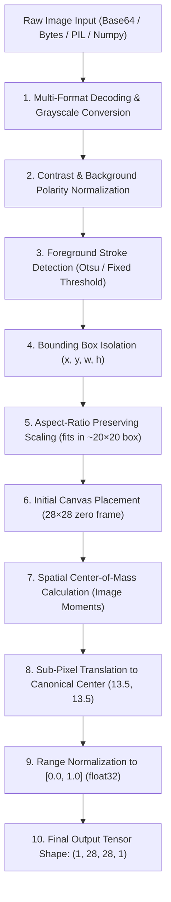

# DIGITVISION AI — Canonical Preprocessing Pipeline Specification

**Document Version:** 1.0.0  
**Phase:** 01 — Data Intelligence & Foundation  
**Classification:** Core System Architectural Invariant  
**Implementation:** `src/preprocessing/canonical.py`  

---

## 1. The Core Architectural Invariant

In machine learning computer vision systems, **train/inference skew** is the leading cause of silent performance degradation in production. If an interactive frontend canvas or real-world image upload transforms pixel coordinates, stroke bounds, or background levels differently from how the offline benchmark was trained, model accuracy collapses even if reported validation metrics are high.

> [!IMPORTANT]
> **SYSTEM INVARIANT:**
> All image inputs—whether raw canvas strokes from the live web UI, uploaded PNG/JPEG files, or offline evaluation batches—must pass through the single authoritative function `canonical_preprocess()` (or its tensor wrapper `canonical_preprocess_tensor()`). Divergent preprocessing implementations are strictly prohibited throughout the repository.

---

## 2. Canonical Pipeline Flow



---

## 3. Mathematical & Algorithmic Formulation

### Step 1: Input Decoding & Grayscale Conversion
Incoming inputs can be arbitrary byte streams, data URLs, RGB matrices, or RGBA matrices.
If an alpha channel $A(x, y)$ is present:
$$\text{Gray}(x, y) = \text{CIE\_Gray}(R, G, B) \cdot \frac{A(x, y)}{255}$$
For 3-channel RGB, standard Rec. 601 luminance weighting is applied:
$$\text{Gray}(x, y) = 0.299 \cdot R(x, y) + 0.587 \cdot G(x, y) + 0.114 \cdot B(x, y)$$

### Step 2: Background Polarity & Contrast Inversion
MNIST requires bright foreground strokes on a dark background ($0$). Real-world scans often arrive as black ink on white paper.
To detect background polarity, four corner patches of dimension $c \times c$ ($c = \max(2, \min(H, W) // 10)$) are sampled:
$$\mu_{\text{corner}} = \frac{1}{4c^2} \sum_{(x, y) \in \text{Corners}} \text{Gray}(x, y)$$
If $\mu_{\text{corner}} > 127$, the canvas is inverted:
$$\text{Gray}_{\text{norm}}(x, y) = 255 - \text{Gray}(x, y)$$

### Step 3: Foreground Binarization & Stroke Isolation
To isolate active digit strokes from background illumination noise, binarization is executed via fixed justified thresholding ($\tau = 25$) or Otsu's adaptive method:
$$B(x, y) = \begin{cases} 255 & \text{if } \text{Gray}_{\text{norm}}(x, y) > \tau \\ 0 & \text{otherwise} \end{cases}$$
Otsu's threshold optimizes inter-class variance $\sigma_B^2(t)$:
$$t^* = \arg\max_{t} \left[ \omega_0(t) \omega_1(t) (\mu_0(t) - \mu_1(t))^2 \right]$$

### Step 4: Tight Bounding Box Detection
Let $\mathcal{S} = \{ (x, y) \mid B(x, y) > 0 \}$ be the set of active stroke pixels. If $|\mathcal{S}| < 8$, the image is classified as empty and immediately returns a zero tensor.
Otherwise, the tight bounding box is extracted:
$$x_{\min} = \min_{(x, y) \in \mathcal{S}} x, \quad x_{\max} = \max_{(x, y) \in \mathcal{S}} x, \quad w = x_{\max} - x_{\min} + 1$$
$$y_{\min} = \min_{(x, y) \in \mathcal{S}} y, \quad y_{\max} = \max_{(x, y) \in \mathcal{S}} y, \quad h = y_{\max} - y_{\min} + 1$$

### Step 5: Aspect-Ratio Preserving Scaling
To fit the digit inside an inner $20 \times 20$ box without anisotropic deformation:
$$s = \frac{20.0}{\max(w, h)}$$
$$w_{\text{new}} = \text{round}(w \cdot s), \quad h_{\text{new}} = \text{round}(h \cdot s)$$
Interpolation selection:
- If $s < 1.0$ (downsampling): OpenCV `INTER_AREA` (avoids Moire artifacts).
- If $s \ge 1.0$ (upsampling): OpenCV `INTER_CUBIC` (smooth continuous edges).

### Step 6 & 7: Spatial Moments & Center of Mass Alignment
The resized stroke is initially placed at the geometric center of a $28 \times 28$ zero canvas $C(x, y)$.
The spatial moments of order $(p + q)$ are computed:
$$m_{pq} = \sum_{x=0}^{27} \sum_{y=0}^{27} x^p y^q \cdot C(x, y)$$
The spatial center-of-mass (centroid) is:
$$\bar{x} = \frac{m_{10}}{m_{00}}, \quad \bar{y} = \frac{m_{01}}{m_{00}}$$
The canonical center of a $28 \times 28$ discrete grid indexed $[0, 27]$ is:
$$x_c = \frac{28 - 1}{2.0} = 13.5, \quad y_c = \frac{28 - 1}{2.0} = 13.5$$
The translation shifts are:
$$\Delta x = 13.5 - \bar{x}, \quad \Delta y = 13.5 - \bar{y}$$

### Step 8: Sub-Pixel Affine Warping
The canvas is shifted by $(\Delta x, \Delta y)$ using bilinear affine transformation:
$$M = \begin{bmatrix} 1 & 0 & \Delta x \\ 0 & 1 & \Delta y \end{bmatrix}$$
$$C_{\text{centered}}(x, y) = \text{warpAffine}(C, M, (28, 28), \text{borderMode}=\text{CONSTANT}, \text{borderValue}=0)$$

### Step 9 & 10: Normalization & Tensor Reshaping
The final image is clipped and converted to float32:
$$X_{\text{final}}(x, y) = \text{clip}\left(\frac{C_{\text{centered}}(x, y)}{255.0}, 0.0, 1.0\right) \in [0.0, 1.0]$$
Reshaped into the standard 4D convolutional tensor:
$$X \in \mathbb{R}^{1 \times 28 \times 28 \times 1}$$

---

## 4. Diagnostic Metadata Payload

Every invocation of `canonical_preprocess()` returns a 2-tuple: `(processed_image, metadata)`.
The metadata dictionary exposes rich diagnostic telemetry:

```json
{
  "raw_shape": [120, 120],
  "is_empty": false,
  "bbox": {"x": 24, "y": 18, "w": 45, "h": 72},
  "centroid_raw": [13.2, 14.8],
  "centroid_final": [13.48, 13.52],
  "dx": 0.30,
  "dy": -1.30,
  "active_pixel_ratio": 0.184,
  "threshold_used": 25.0
}
```

This telemetry is directly ingested by `src.intelligence.quality.assess_input_quality` to compute physical input quality scores and flag off-center or degraded strokes.

---

## 5. Verification & Test Suite

The canonical preprocessing invariant is validated under `tests/test_preprocessing.py` across 12 rigorous test cases:
1. `test_input_dimensions_and_channels`: 2D, 3D RGB, 4D RGBA support.
2. `test_grayscale_conversion`: Color stroke conversion accuracy.
3. `test_inversion_and_contrast_normalization`: Light-on-dark vs dark-on-light.
4. `test_normalization_bounds_and_dtype`: Range $[0.0, 1.0]$, dtype `float32`, no NaNs.
5. `test_bounding_box_extraction`: Tight bounding coordinates.
6. `test_centering_and_centroid_alignment`: Final centroid within $\pm 1.0$ px of $(13.5, 13.5)$.
7. `test_empty_image`: Blank canvas safety without failure.
8. `test_noisy_image`: Low-amplitude background suppression.
9. `test_oversized_image`: Clean downsampling of high-resolution inputs (e.g. $512 \times 512$).
10. `test_tiny_image`: Upsampling of small inputs (e.g. $10 \times 10$).
11. `test_already_28x28_image`: Seamless pass-through of native MNIST dimensions.
12. `test_canonical_preprocess_tensor`: Verification of exact shape $(1, 28, 28, 1)$ float32.
